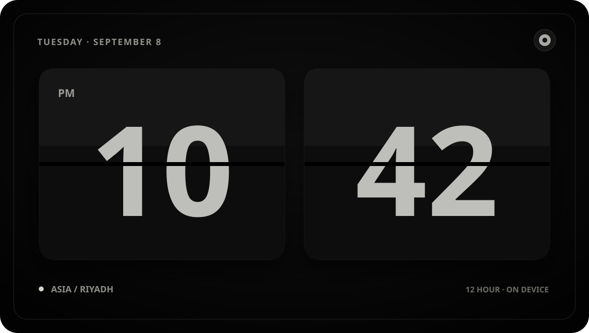

# Build a Copilot Canvas Extension

Build a polished Flip Clock while learning how a GitHub Copilot extension
declares, serves, configures, and packages a canvas.

## Welcome

- **Who is this for**: JavaScript developers who are comfortable editing a
  repository and want to extend GitHub Copilot with an interactive canvas.
- **What you'll learn**: How project-scoped extensions are discovered, how
  `joinSession` registers a canvas, how a loopback renderer is managed, and how
  validated actions update durable preferences.
- **What you'll build**: A responsive split-flap clock with timezone, hour
  cycle, theme, and motion controls.
- **Prerequisites**:
  - A GitHub account with GitHub Actions enabled.
  - Basic familiarity with JavaScript modules and JSON.
  - Optional for the live preview: the GitHub Copilot desktop/CLI runtime on a
    supported local machine.
- **How long**: About 45 minutes.

In this exercise, you will:

1. Declare a project-scoped extension and register the `flip-clock` canvas.
1. Connect the canvas to a reusable loopback renderer and clean up its lifecycle.
1. Add a schema-validated action backed by durable user preferences.
1. Harden, test, package, and optionally run the canvas locally.

> [!IMPORTANT]
> The canvas API is experimental and may change. Codespaces and GitHub Actions
> can complete and grade the code, but they cannot display the host canvas.
> Live rendering requires the GitHub Copilot desktop/CLI runtime locally.

### How to start this exercise

Copy the exercise to your account. Give Mona about **20 seconds** to prepare the
first lesson, then refresh the new repository page.

Having trouble? 🤷
 

- Choose your personal account or an organization as the owner.
- A public repository avoids consuming private-repository Actions minutes.
- If the lesson does not appear, check the **Actions** tab for the
  **Step 0** workflow and enable workflows if GitHub asks.

---

© 2026 ragmha · [MIT License](LICENSE) · [Code of Conduct](CODE_OF_CONDUCT.md)

This is an independent personal project maintained by `ragmha`. It is not
affiliated with, endorsed by, or sponsored by GitHub or any other organization.
